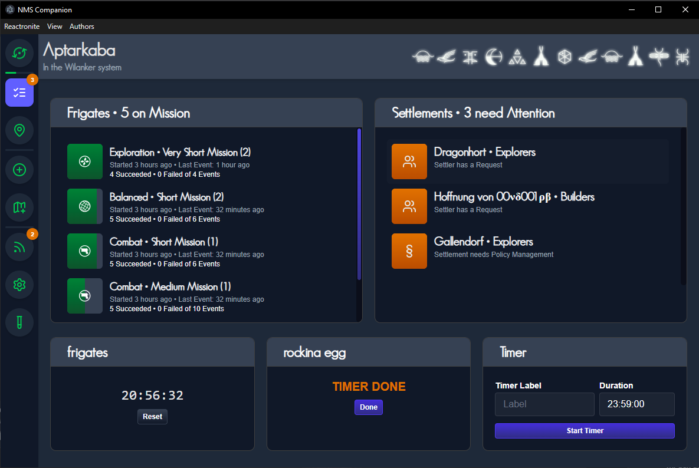
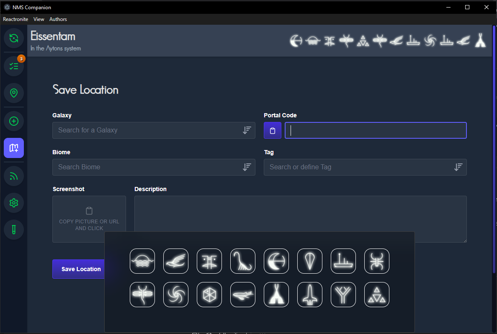

# No Man's Sky Companion

**No Man's Sky Companion** is a utility tool for players of *No Man's Sky*. It allows you to read and parse your save files, providing useful information and tools to help you manage your universe more efficiently.

## Features

- **Parse Save Files**: Read and analyze selectable `.hg` save files from *No Man's Sky*. 
- **Player Position as Glyphs**: Display your current in-game position in the portal glyph format. (Does not work in Multiplayer!)
- **Searchable Location Database**: Browse a database of your saved locations, based on Tags, Description, Biomes and Galaxy
- **Manual & Automatic Position Entry**: Add new locations manually or let the program detect them automatically.  
    - Biome decoder, decodes for example altnames like "Overgrown" to "Lush" via Autocomplete
    - Galaxy autocomplete 
    - Easy Screenshot Component, which can take URLs or clipboard image data
    - In Singleplayer automatically parses your position to the correct glyph Portalcode and fills out the correct galaxy
- **Missions Dashboard**: View the current status of your settlements and frigate missions.
- **Manual Timers**: Set Manual Timers for Eggs or other things
- **Legendary Fish Tracker**: Todo/Tracklist for your Legendary Fishes, information about prices and biomes from [here](https://steamcommunity.com/sharedfiles/filedetails/?id=3331441951) and [nomansskyresources](https://www.nomansskyresources.com/)
- **NMS Coordinates Feed**: RSS Feedreader for the [NMSCoordinateExchange](https://www.reddit.com/r/NMSCoordinateExchange/) Reddit

## License
[MIT License]  
