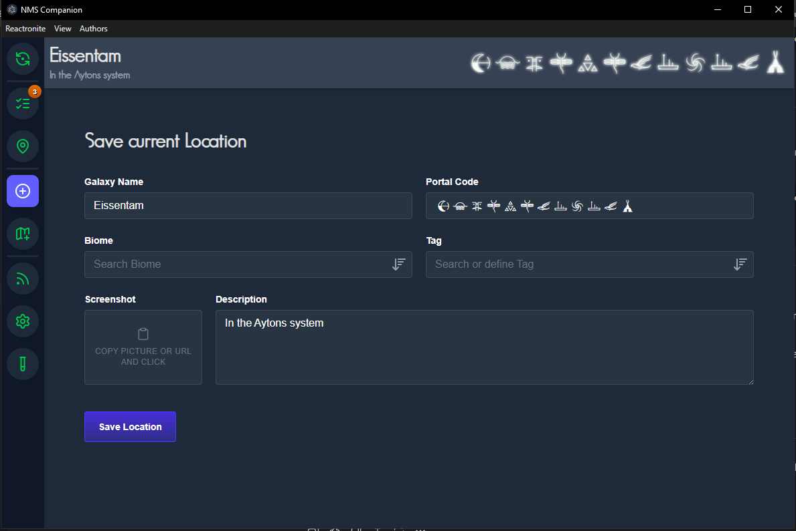

# No Man's Sky Companion

**No Man's Sky Companion** is a utility tool for players of *No Man's Sky*. It allows you to read and parse your save files, providing useful information and tools to help you manage your universe more efficiently.

## Features

- **Parse Save Files**: Read and analyze selectable `.hg` save files from *No Man's Sky*.  
- **Player Position as Glyphs**: Display your current in-game position in the iconic glyph format.  
- **Searchable Location Database**: Browse a database of locations with screenshots for easy reference.  
- **Manual & Automatic Position Entry**: Add new locations manually or let the program detect them automatically.  
- **Missions Dashboard**: View the current status of your settlements and frigate missions. Or set manual Timers for your Eggs or other things

## License
[MIT License]  
